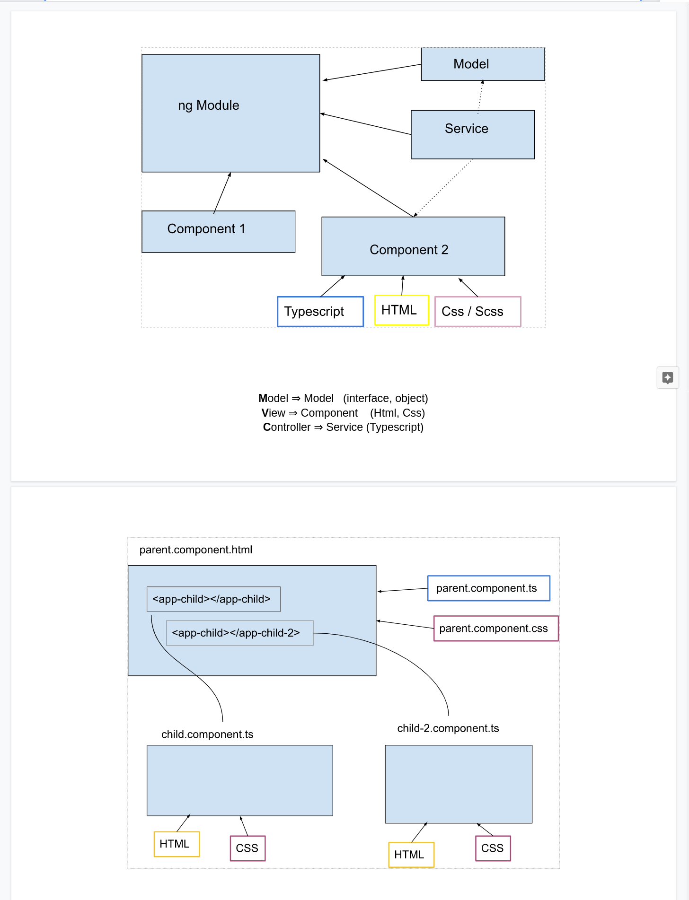

# 09-angular-intro

### Témakörök:

- angular cli telepítés: ```npm install -g @angular/cli```
- új angular project instalálása: ```ng new project-name```
- modulok
- komponensek
- service-ek
- model-lek

**Angular documentáció =>** [Angular Io](https://angular.io/)

**Angular university =>** [Angular university](https://angular-university.io/)

**MVC Pattern in angular =>** [Angular MVC Pattern](https://betterprogramming.pub/https-medium-com-ccaballero-understanding-mvc-services-for-front-end-angular-a6196492ee74)
### Angular struktúra:



